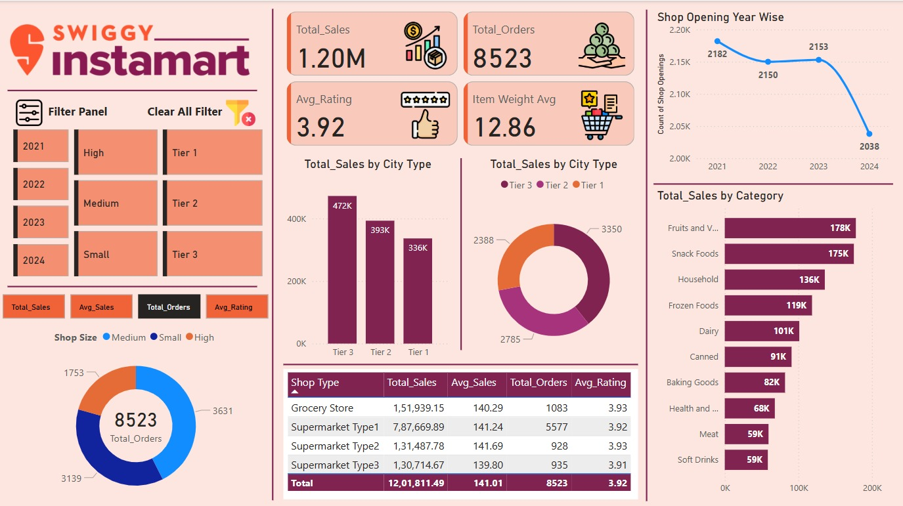

# 📊 Swiggy Instamart Sales Dashboard (2021–2024)

This Power BI project analyzes Swiggy Instamart sales data from 2021 to 2024. The dashboard provides a comprehensive overview of performance metrics such as total sales, orders, ratings, and shop trends across different city tiers and shop types.

---

## 📁 Project Overview

**Objective:**  
To uncover insights from Swiggy Instamart sales data and visualize performance across years, shop types, city tiers, and product categories to support strategic decision-making.

---

## 🚀 Key Features

- 📅 Analysis from **2021 to 2024**
- 🏪 Filters for **Shop Size**, **City Tier**, and **Year**
- 📈 KPIs: **Total Sales**, **Total Orders**, **Average Rating**, **Average Item Weight**
- 📊 Visuals include:
  - Sales by **City Type**
  - Orders by **Shop Size**
  - Sales by **Category**
  - Shop Opening Trends
  - Detailed Table by Shop Type

---

## 📌 Insights Discovered

- **Tier 3 cities** lead in total sales.
- **Supermarket Type 1** generates the highest sales and order volume.
- **Fruits & Vegetables** and **Snack Foods** are top-selling product categories.
- Decline in **store openings** in 2024 signals potential market saturation or strategic shift.

---

## 🛠 Tools Used

- **Power BI Desktop**
- Data transformation via **Power Query**
- Calculations using **DAX (Data Analysis Expressions)**

---

## 📷 Dashboard Preview

---

## 📂 Files Included

- `Icons` – Icons image Folder
- `Swiggy-Instamart-Dashboard.pbix` – Main Power BI dashboard file
- `README.md` – Project documentation
- `Dashboard.png` – Dashboard image preview
- `Instamart_Data.xlsx` – Instamart Sales Data

---

## 💡 Future Improvements

- Add predictive analytics for 2025 projections
- Integrate real-time data using API connections
- Compare performance with competitors

---

## 👨‍💻 Author

**Ritesh Zambare**  
Data Analyst | Power BI Enthusiast  
📧 [https://www.linkedin.com/in/ritesh-zambare-0265032b0/]

---

## ⭐ Show your support

If you like this project, please ⭐ star the repo and share it with others in the data community!

